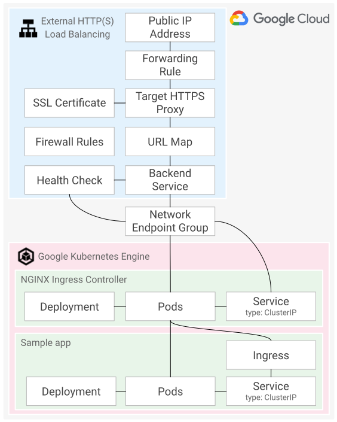

# External HTTP(S) Load Balancing with NGINX Ingress Controller using Config Connector on Google Kubernetes Engine

This tutorial shows you how to set up external HTTP(S) load balancing with the
NGINX Ingress Controller on Google Kubernetes Engine (GKE) using Config
Connector.

<walkthrough-alt>

If you like, you can take the interactive version of this tutorial, which runs
in the Cloud Console:

[](https://ssh.cloud.google.com/cloudshell/editor?cloudshell_git_repo=https%3A%2F%2Fgithub.com%2Fhalvards%2Fcommunity.git&cloudshell_git_branch=https-load-balancing-ingress-nginx-config-connector-gke&cloudshell_working_dir=tutorials%2Fhttps-load-balancing-ingress-nginx-config-connector-gke&cloudshell_tutorial=index.md)

</walkthrough-alt>

## Introduction

[External HTTP(S) load balancing](https://cloud.google.com/load-balancing/docs/https)
is a powerful and flexible way to route external traffic to your GCP resources,
such as apps running on
[Google Kubernetes Engine (GKE)](https://cloud.google.com/kubernetes-engine)
clusters. It also integrates with other Google Cloud products such as
[Google Cloud Armor](https://cloud.google.com/armor),
[Cloud CDN](https://cloud.google.com/cdn),
[Google-managed SSL certificates](https://cloud.google.com/load-balancing/docs/ssl-certificates/google-managed-certs),
and [Identity-Aware Proxy](https://cloud.google.com/iap).

If your GKE cluster has many externally-facing services exposed on different
URL paths on the same hostname, you may run into
[limits on the URL map](https://cloud.google.com/load-balancing/docs/quotas#url_maps)
resource of external HTTP(S) load balancing. Additionally, changes to backend
services associated with external HTTP(S) load balancing can take
[several minutes to propagate](https://cloud.google.com/load-balancing/docs/https/#backend_services)
throughout the network.

If these constraints are a concern, a good practice is to use external HTTP(S)
load balancing to route traffic to the GKE cluster, and then use a gateway or
proxy running in the cluster to route requests once they reach the cluster. In
this patterns, the external HTTP(S) load balancing configuration points at the
cluster gateway or proxy. URL path-based routing is configured on the gateway
or proxy.

There are many options for implementing a cluster gateway. This tutorial uses
the [NGINX Ingress Controller](https://github.com/kubernetes/ingress-nginx).
This allows cluster operators to configure routing rules using the
[Kubernetes Ingress API](https://kubernetes.io/docs/concepts/services-networking/ingress/).

To route requests from the external load balancer to the cluster gateway
efficiently and avoid unnecessary network hops, this tutorial shows you how to
configure the NGINX Ingress Controller to use
[container-native load balancing with standalone network endpoint groups (NEGs)](https://cloud.google.com/kubernetes-engine/docs/how-to/standalone-neg).

<walkthrough-alt>

The diagram below shows the resources you will create in this tutorial.



</walkthrough-alt>

[Config Connector](https://cloud.google.com/config-connector) allows you to
manage the lifecycle of GCP resources as
[Kubernetes custom resources](https://kubernetes.io/docs/concepts/extend-kubernetes/api-extension/custom-resources/).
The benefit is that this allows you to manage both your GCP resources and your
Kubernetes resources using a consistent model. In this tutorial you use Config
Connector to create the resources required for external HTTP(S) load balancing.

It is possible to create external HTTP(S) load balancing resources using the
[GKE Ingress controller](https://cloud.google.com/kubernetes-engine/docs/concepts/ingress).
instead of using Config Connector. Using GKE Ingress involves fewer steps as it
defines a specific set of load balancing resources that were chosen in an
opinionated way to make them easy to use. This tutorial does not use GKE
Ingress for these reasons:

-   Running more than one ingress controller (GKE Ingress and NGINX Ingress
    Controller) in the same cluster requires careful management of the
    [`kubernetes.io/ingress.class` annotation](https://kubernetes.io/docs/concepts/services-networking/ingress-controllers/#using-multiple-ingress-controllers)
    on any Ingress resource you create to ensure the intended ingress
    controller acts on the resource.
-   The
    [constraints on health checks](https://cloud.google.com/kubernetes-engine/docs/concepts/ingress#health_checks)
    means that GKE Ingress cannot use the default NGINX Ingress Controller
    health check endpoint.

## Objectives

-   Create a GKE cluster.
-   Install the NGINX Ingress Controller and create a standalone NEG.
-   Install Config Connector.
-   Configure external HTTP(S) load balancing.
-   Deploy a sample app.
-   Verify the solution.

## Costs

This tutorial uses the following billable components of Google Cloud:

-   [Cloud Logging](https://cloud.google.com/stackdriver/pricing#logging-costs)
-   [Compute Engine](https://cloud.google.com/compute/network-pricing)
-   [GKE](https://cloud.google.com/kubernetes-engine/pricing)

To generate a cost estimate based on your projected usage, use the
[pricing calculator](https://cloud.google.com/products/calculator).
New Google Cloud users might be eligible for a free trial.

When you finish this tutorial, you can avoid continued billing by deleting the
resources you created. For more information, see [Cleaning up](#cleaning-up).

## Before you begin

<walkthrough-project-billing-setup></walkthrough-project-billing-setup>

<walkthrough-alt>

1.  [Sign in](https://accounts.google.com/Login) to your Google Account.

    If you don't already have one,
    [sign up for a new account](https://accounts.google.com/SignUp).

2.  In the Cloud Console, on the project selector page, select or create a
    Google Cloud project.

    **Note:** If you don't plan to keep the resources that you create in this
    procedure, create a project instead of selecting an existing project. After
    you finish these steps, you can delete the project, removing all resources
    associated with the project.

    [Go to the project selector page](https://console.cloud.google.com/projectselector2/home/dashboard)

3.  Make sure that billing is enabled for your Google Cloud project.
    [Learn how to confirm billing is enabled for your project.](https://cloud.google.com/billing/docs/how-to/modify-project)

4.  In the Cloud Console, go to Cloud Shell.

    [](https://ssh.cloud.google.com/cloudshell/editor?cloudshell_git_repo=https%3A%2F%2Fgithub.com%2Fhalvards%2Fcommunity.git&cloudshell_git_branch=https-load-balancing-ingress-nginx-config-connector-gke&cloudshell_working_dir=tutorials%2Fhttps-load-balancing-ingress-nginx-config-connector-gke)

    Click **Confirm** to clone the Git repo into your Cloud Shell.

    At the bottom of the Cloud Console, a Cloud Shell session opens and
    displays a command-line prompt. Cloud Shell is a Linux shell environment
    with the Cloud SDK already installed, including the `gcloud` command-line
    tool, and with values already set for your current project. It can take a
    few seconds for the session to initialize. You use Cloud Shell to run all
    the commands in this tutorial.

</walkthrough-alt>

## Setting up the environment

1.  In Cloud Shell, set the Google Cloud project you want to use for this
    tutorial:

    ```bash
    gcloud config set project PROJECT_ID
    ```

    where `PROJECT_ID` is your project ID.

2.  Enable the Google Cloud and GKE APIs:

    ```bash
    gcloud services enable \
        cloudapis.googleapis.com \
        container.googleapis.com
    ```

    Wait until you see that the operation finished successfully. This may take
    a minute or so.

3.  Set the `gcloud` tool default Compute Engine zone:

    ```bash
    gcloud config set compute/zone us-central1-f
    ```

    This is zone where you will create the GKE cluster.

    **Note:** You can
    [choose a different zone](https://cloud.google.com/compute/docs/regions-zones).

4.  Store the zone in an exported environment variable called `ZONE`:

    ```bash
    export ZONE=$(gcloud config get-value compute/zone)
    ```

## Creating the GKE cluster

1.  In Cloud Shell, create a GKE cluster with Workload Identity and the
    `ConfigConnector` add-on:

    ```bash
    gcloud beta container clusters create gclb-ingress-nginx-cc \
        --addons ConfigConnector \
        --cluster-version latest \
        --enable-ip-alias \
        --enable-stackdriver-kubernetes \
        --workload-pool $GOOGLE_CLOUD_PROJECT.svc.id.goog
    ```

    The `ConfigConnector` add-on installs the Config Connector operator in your
    GKE cluster.

    **Note:** This tutorial assumes GKE version 1.15.11-gke.12 and above,
    1.16.8-gke.12 and above, or 1.17.5-gke.0 and above.

2.  Bind the `cluster-admin` Kubernetes role to your Google account using the
    `kubectl` command-line tool. You need this to install the NGINX Ingress
    Controller:

    ```bash
    kubectl create clusterrolebinding cluster-admin-binding \
        --clusterrole cluster-admin \
        --user $(gcloud config get-value core/account)
    ```

## Installing the NGINX Ingress Controller

1.  In Cloud Shell, download the NGINX Ingress Controller installation
    manifest:

    ```bash
    INGRESS_NGINX_VERSION=0.32.0

    curl -Lo manifests/ingress-nginx/deploy.yaml "https://raw.githubusercontent.com/kubernetes/ingress-nginx/controller-${INGRESS_NGINX_VERSION}/deploy/static/provider/cloud/deploy.yaml"
    ```

2.  View the patch file that changes the `ingress-nginx-controller` Kubernetes
    Service resource spec `type` to `ClusterIP` and adds the
    `cloud.google.com/neg` annotation to create a standalone NEG on port 443.

    <walkthrough-editor-select-line
        filePath="cloudshell_open/community/tutorials/https-load-balancing-ingress-nginx-config-connector-gke/manifests/ingress-nginx/patch-service.yaml"
        startLine="15" startCharacterOffset="0"
        endLine="15" endCharacterOffset="0"
        text="Open patch-service.yaml">
    </walkthrough-editor-select-line>

    <walkthrough-alt>

    `manifests/ingress-nginx/patch-service.yaml`:

    [embedmd]:# (manifests/ingress-nginx/patch-service.yaml yaml /apiVersion/ /ClusterIP/)
    ```yaml
    apiVersion: v1
    kind: Service
    metadata:
      name: ingress-nginx-controller
      namespace: ingress-nginx
      annotations:
        cloud.google.com/neg: '{"exposed_ports": {"443": {}}}'
    spec:
      externalTrafficPolicy: ''
      type: ClusterIP
    ```

    </walkthrough-alt>

    This tutorial creates a NEG on port 443 so that traffic between the load
    balancer and the NGINX Ingress Controller uses the HTTPS protocol. If you
    want to use unencrypted HTTP/1.1 instead, change the value in
    `exposed_ports` from 443 to 80.

3.  View the patch file that changes the `ingress-nginx-controller` Kubernetes
    Deployment resource by adding a `containerPort` for the NGINX health check
    port and setting the desired number of pods (`replicas`) to `2`.

    <walkthrough-editor-select-line
        filePath="cloudshell_open/community/tutorials/https-load-balancing-ingress-nginx-config-connector-gke/manifests/ingress-nginx/patch-deployment.yaml"
        startLine="15" startCharacterOffset="0"
        endLine="15" endCharacterOffset="0"
        text="Open patch-deployment.yaml">
    </walkthrough-editor-select-line>

    <walkthrough-alt>

    `manifests/ingress-nginx/patch-deployment.yaml`:

    [embedmd]:# (manifests/ingress-nginx/patch-deployment.yaml yaml /apiVersion/ /health/)
    ```yaml
    apiVersion: apps/v1
    kind: Deployment
    metadata:
      name: ingress-nginx-controller
      namespace: ingress-nginx
    spec:
      replicas: 2
      template:
        spec:
          containers:
          - name: controller
            ports:
            - containerPort: 10254
              name: health
    ```

    </walkthrough-alt>

    You will use this health check port later when you set up external HTTP(S)
    load balancing health checks.

4.  View the `kustomization.yaml` file that you will use to apply the
    downloaded manifest and the patches.

    <walkthrough-editor-select-line
        filePath="cloudshell_open/community/tutorials/https-load-balancing-ingress-nginx-config-connector-gke/manifests/ingress-nginx/kustomization.yaml"
        startLine="15" startCharacterOffset="0"
        endLine="15" endCharacterOffset="0"
        text="Open kustomization.yaml">
    </walkthrough-editor-select-line>

    <walkthrough-alt>

    `manifests/ingress-nginx/kustomization.yaml`:

    [embedmd]:# (manifests/ingress-nginx/kustomization.yaml yaml /apiVersion/ /patch-service\.yaml/)
    ```yaml
    apiVersion: kustomize.config.k8s.io/v1beta1
    kind: Kustomization
    resources:
    - deploy.yaml
    patchesStrategicMerge:
    - patch-deployment.yaml
    - patch-service.yaml
    ```

    </walkthrough-alt>

    If you would like to learn more about Kustomize, please refer to the
    [Kustomize documentation](https://kustomize.io/).

5.  Install the NGINX Ingress Controller by applying the manifest and the
    patches:

    ```bash
    kubectl apply --kustomize manifests/ingress-nginx
    ```

**Note:** In this tutorial you don't provide an SSL certificate when setting up
the NGINX Ingress Controller. In this situation, the NGINX Ingress Controller
creates a self-signed SSL certificate to serve HTTPS traffic on port 443.
[A self-signed certificate is sufficient for using the HTTPS protocol](https://cloud.google.com/load-balancing/docs/backend-service#encryption_between_the_load_balancer_and_backends)
for traffic between the external HTTP(S) load balancer and NGINX running in
your GKE cluster. Later in the tutorial you will provision a Google-managed SSL
certificate that the external HTTP(S) load balancer will present to clients.

## Installing Config Connector

You provide permissions to Config Connector using GKE
[Workload Identity](https://cloud.google.com/kubernetes-engine/docs/how-to/workload-identity).

**Note:** In a production deployment we recommend running Config Connector in a
separate GKE cluster from your workloads. This tutorial uses one GKE cluster
for simplicity.

1.  In Cloud Shell, create a `ConfigConnector` resource in your GKE cluster.

    ```bash
    kubectl apply --filename manifests/config-connector/config-connector.yaml
    ```

    <walkthrough-editor-select-line
        filePath="cloudshell_open/community/tutorials/https-load-balancing-ingress-nginx-config-connector-gke/manifests/config-connector/config-connector.yaml"
        startLine="15" startCharacterOffset="0"
        endLine="15" endCharacterOffset="0"
        text="Open config-connector.yaml">
    </walkthrough-editor-select-line>

    <walkthrough-alt>

    `manifests/config-connector/config-connector.yaml`:

    [embedmd]:# (manifests/config-connector/config-connector.yaml yaml /apiVersion/ /name: configconnector.core.cnrm.cloud.google.com/)
    ```yaml
    apiVersion: core.cnrm.cloud.google.com/v1beta1
    kind: ConfigConnector
    metadata:
      name: configconnector.core.cnrm.cloud.google.com
    ```

    </walkthrough-alt>

    After you create this resource, the Config Connector operator installs
    [custom resource definitions (CRDs)](https://kubernetes.io/docs/tasks/access-kubernetes-api/custom-resources/custom-resource-definitions/)
    for Google Cloud resources, as well as additional Config Connector
    components.

2.  Create a Cloud Identity and Access Management (IAM) service account. Config
    Connector will use this service account to create resources in your
    project:

    ```bash
    export SA_EMAIL=$(gcloud iam service-accounts create config-connector \
        --display-name "Config Connector service account" \
        --format "value(email)")
    ```

3.  Grant the
    [Editor](https://cloud.google.com/iam/docs/understanding-roles#primitive_roles)
    Cloud IAM role to the service account:

    ```bash
    gcloud projects add-iam-policy-binding $GOOGLE_CLOUD_PROJECT \
        --member serviceAccount:$SA_EMAIL \
        --role roles/editor
    ```

4.  Create a namespace that will contain your Config Connector resources:

    ```bash
    export NAMESPACE=$GOOGLE_CLOUD_PROJECT

    kubectl create ns $NAMESPACE
    ```

    This tutorial uses your Google Cloud project ID as the name of the
    namespace for convenience. You can give your namespace a different name if
    you like.

5.  Create a `ConfigConnectorContext` resource in the namespace you just
    created. The Config Connector operator watches all namespaces in the GKE
    cluster that contain a `ConfigConnectorContext` resource:

    ```bash
    envsubst < manifests/config-connector/config-connector-context.tmpl.yaml \
        | kubectl apply -f -
    ```

    <walkthrough-editor-select-line
        filePath="cloudshell_open/community/tutorials/https-load-balancing-ingress-nginx-config-connector-gke/manifests/config-connector/config-connector-context.tmpl.yaml"
        startLine="15" startCharacterOffset="0"
        endLine="15" endCharacterOffset="0"
        text="Open config-connector-context.tmpl.yaml">
    </walkthrough-editor-select-line>

    <walkthrough-alt>

    `manifests/config-connector/config-connector-context.tmpl.yaml`:

    [embedmd]:# (manifests/config-connector/config-connector-context.tmpl.yaml yaml /apiVersion/ /SA_EMAIL/)
    ```yaml
    apiVersion: core.cnrm.cloud.google.com/v1beta1
    kind: ConfigConnectorContext
    metadata:
      name: configconnectorcontext.core.cnrm.cloud.google.com
      namespace: $NAMESPACE
    spec:
      googleServiceAccount: $SA_EMAIL
    ```

    </walkthrough-alt>

6.  Create a Cloud IAM policy binding to bind the Cloud IAM service account you
    created to the Kubernetes service account used by Config Connector:

    ```bash
    gcloud iam service-accounts add-iam-policy-binding $SA_EMAIL \
        --member "serviceAccount:$GOOGLE_CLOUD_PROJECT.svc.id.goog[cnrm-system/cnrm-controller-manager-$NAMESPACE]" \
        --role roles/iam.workloadIdentityUser
    ```

6.  Annotate the namespace you just created with the project ID where you want
    Config Connector to create resources:

    ```bash
    kubectl annotate namespace $NAMESPACE \
        cnrm.cloud.google.com/project-id=$GOOGLE_CLOUD_PROJECT
    ```

    The project ID in this annotation becomes the default Google Cloud project
    for Config Connector resources created in this namespace.

7.  Set the namespace you just created as the default namespace for the
    `kubectl` command-line tool:

    ```bash
    kubectl config set-context --current --namespace $NAMESPACE
    ```

## Configuring external HTTP(S) load balancing

External HTTP(S) load balancing consists of
[several resources](https://cloud.google.com/load-balancing/docs/https).
You use the instructions below to create the resources required for external
HTTP(S) load balancing step by step, using Config Connector.

1.  In Cloud Shell, create a firewall rule to allow load balancing proxy and
    health check requests access to the cluster:

    ```bash
    kubectl apply -f manifests/https-load-balancing/firewall.yaml
    ```

    <walkthrough-editor-select-line
        filePath="cloudshell_open/community/tutorials/https-load-balancing-ingress-nginx-config-connector-gke/manifests/https-load-balancing/firewall.yaml"
        startLine="15" startCharacterOffset="0"
        endLine="15" endCharacterOffset="0"
        text="Open firewall.yaml">
    </walkthrough-editor-select-line>

    <walkthrough-alt>

    `manifests/https-load-balancing/firewall.yaml`:

    [embedmd]:# (manifests/https-load-balancing/firewall.yaml yaml /apiVersion/ /default/)
    ```yaml
    apiVersion: compute.cnrm.cloud.google.com/v1beta1
    kind: ComputeFirewall
    metadata:
      name: gclb-ingress-nginx-cc-tutorial-firewall
    spec:
      allow:
      - protocol: tcp
        ports:
        - "443"
        - "10254"
      networkRef:
        external: default
    ```

    </walkthrough-alt>

2.  Create a health check:

    ```bash
    kubectl apply -f manifests/https-load-balancing/health-check.yaml
    ```

    <walkthrough-editor-select-line
        filePath="cloudshell_open/community/tutorials/https-load-balancing-ingress-nginx-config-connector-gke/manifests/https-load-balancing/health-check.yaml"
        startLine="15" startCharacterOffset="0"
        endLine="15" endCharacterOffset="0"
        text="Open health-check.yaml">
    </walkthrough-editor-select-line>

    <walkthrough-alt>

    `manifests/https-load-balancing/health-check.yaml`:

    [embedmd]:# (manifests/https-load-balancing/health-check.yaml yaml /apiVersion/ /global/)
    ```yaml
    apiVersion: compute.cnrm.cloud.google.com/v1beta1
    kind: ComputeHealthCheck
    metadata:
      name: gclb-ingress-nginx-cc-tutorial-health-check
    spec:
      httpHealthCheck:
        port: 10254
        requestPath: /healthz
      location: global
    ```

    </walkthrough-alt>

    This health check uses the
    [health check endpoint of the NGINX Ingress Controller](https://kubernetes.github.io/ingress-nginx/user-guide/cli-arguments/).

3.  In Cloud Shell, find the name of your NEG and store it in an exported
    environment variable called `NEG_NAME`:

    ```bash
    export NEG_NAME=$(kubectl get svc ingress-nginx-controller \
        -o'go-template={{index .metadata.annotations "cloud.google.com/neg-status"}}' \
        -n ingress-nginx | jq -r '.network_endpoint_groups["443"]')
    ```

4.  Create a backend service with a backend that references your NEG using an
    [external reference](https://cloud.google.com/config-connector/docs/how-to/creating-resource-references#external_references):

    ```bash
    envsubst < manifests/https-load-balancing/backend-service.tmpl.yaml \
        | kubectl apply -f -
    ```

    <walkthrough-editor-select-line
        filePath="cloudshell_open/community/tutorials/https-load-balancing-ingress-nginx-config-connector-gke/manifests/https-load-balancing/backend-service.tmpl.yaml"
        startLine="15" startCharacterOffset="0"
        endLine="15" endCharacterOffset="0"
        text="Open backend-service.tmpl.yaml">
    </walkthrough-editor-select-line>

    <walkthrough-alt>

    `manifests/https-load-balancing/backend-service.tmpl.yaml`:

    [embedmd]:# (manifests/https-load-balancing/backend-service.tmpl.yaml yaml /apiVersion/ /HTTPS/)
    ```yaml
    apiVersion: compute.cnrm.cloud.google.com/v1beta1
    kind: ComputeBackendService
    metadata:
      name: gclb-ingress-nginx-cc-tutorial-backend-service
    spec:
      backend:
      - balancingMode: RATE
        group:
          networkEndpointGroupRef:
            external: https://www.googleapis.com/compute/v1/projects/$GOOGLE_CLOUD_PROJECT/zones/$ZONE/networkEndpointGroups/$NEG_NAME
        maxRate: 1
      healthChecks:
      - healthCheckRef:
          name: gclb-ingress-nginx-cc-tutorial-health-check
      location: global
      protocol: HTTPS
    ```

    </walkthrough-alt>

    **Note:** In this tutorial you have one NEG, because you use a zonal GKE
    cluster, and because the NEG exposes one port. In general, you will have
    one NEG per zone per exposed port, and you will have to add each NEG as a
    separate backend to the backend service.

    **Note:** The backend definition contains a `maxRate` field, which is the
    target maximum request rate for the backend. The value of this field is not
    a circuit breaker. This means that the backend service will allow requests
    to be forwarded to the backend at a rate higher than the `maxRate` value.
    The `maxRate` value is used to balance request rates across multiple
    backends. In this tutorial you only have one backend, so the value of the
    `maxRate` field has no effect on the request rate to your backend. If you
    would like to learn more, please read the documentation on
    [target capacity for backend services](https://cloud.google.com/load-balancing/docs/backend-service#target_capacity).

5.  Create a URL map with your backend service as the default service:

    ```bash
    kubectl apply -f manifests/https-load-balancing/url-map.yaml
    ```

    <walkthrough-editor-select-line
        filePath="cloudshell_open/community/tutorials/https-load-balancing-ingress-nginx-config-connector-gke/manifests/https-load-balancing/url-map.yaml"
        startLine="15" startCharacterOffset="0"
        endLine="15" endCharacterOffset="0"
        text="Open url-map.yaml">
    </walkthrough-editor-select-line>

    <walkthrough-alt>

    `manifests/https-load-balancing/url-map.yaml`:

    [embedmd]:# (manifests/https-load-balancing/url-map.yaml yaml /apiVersion/ /global/)
    ```yaml
    apiVersion: compute.cnrm.cloud.google.com/v1beta1
    kind: ComputeURLMap
    metadata:
      name: gclb-ingress-nginx-cc-tutorial-url-map
    spec:
      defaultService:
        backendServiceRef:
          name: gclb-ingress-nginx-cc-tutorial-backend-service
      location: global
    ```

    </walkthrough-alt>

6.  Reserve a public IP address for your load balancer:

    ```bash
    kubectl apply -f manifests/https-load-balancing/address.yaml
    ```

    <walkthrough-editor-select-line
        filePath="cloudshell_open/community/tutorials/https-load-balancing-ingress-nginx-config-connector-gke/manifests/https-load-balancing/address.yaml"
        startLine="15" startCharacterOffset="0"
        endLine="15" endCharacterOffset="0"
        text="Open address.yaml">
    </walkthrough-editor-select-line>

    <walkthrough-alt>

    `manifests/https-load-balancing/address.yaml`:

    [embedmd]:# (manifests/https-load-balancing/address.yaml yaml /apiVersion/ /global/)
    ```yaml
    apiVersion: compute.cnrm.cloud.google.com/v1beta1
    kind: ComputeAddress
    metadata:
      name: gclb-ingress-nginx-cc-tutorial-address
    spec:
      location: global
    ```

    </walkthrough-alt>

7.  Store the reserved IP address in an environment variable called
    `EXTERNAL_IP`:

    ```bash
    EXTERNAL_IP=$(./scripts/get-external-ip.sh)
    echo $EXTERNAL_IP
    ```

    <walkthrough-editor-select-line
        filePath="cloudshell_open/community/tutorials/https-load-balancing-ingress-nginx-config-connector-gke/scripts/get-external-ip.sh"
        startLine="19" startCharacterOffset="0"
        endLine="19" endCharacterOffset="0"
        text="Open get-external-ip.sh">
    </walkthrough-editor-select-line>

    <walkthrough-alt>

    `scripts/get-external-ip.sh`:

    [embedmd]:# (scripts/get-external-ip.sh bash /get_reserved_ip/ /done/)
    ```bash
    get_reserved_ip () {
        reserved_ip=$(kubectl get computeaddress \
            gclb-ingress-nginx-cc-tutorial-address \
            -o jsonpath='{.spec.address}')
    }
    get_reserved_ip
    while [ -z "$reserved_ip" ]; do
        sleep 2
        get_reserved_ip
    done
    ```

    </walkthrough-alt>

8.  Store the domain name you will use for this tutorial in an exported
    environment variable called `DOMAIN`:

    ```bash
    export DOMAIN=$(echo $EXTERNAL_IP | tr '.' '-').nip.io
    echo $DOMAIN
    ```

    In this tutorial, you use the free wildcard DNS test site
    [nip.io](https://nip.io/) for testing purposes only. Specifically, you use
    the "dash notation", where the domain name is your reserved IP address
    with the dots (".") replaced by dashes ("-"), followed by ".nip.io". For
    instance, if your reserved IP address is `203.0.113.1`, your domain name
    for this tutorial will be `203-0-113-1.nip.io`.

    **Note:** For a production environment, we recommend you create a DNS A
    record for a domain name you own and set its value to the public IP address
    you reserved. If you use Cloud DNS you can follow the
    [Cloud DNS quickstart](https://cloud.google.com/dns/docs/quickstart#create_a_new_record),
    or use the
    [Config Connector resources for Cloud DNS](https://cloud.google.com/config-connector/docs/reference/resources#dnsmanagedzone).
    If you use another provider, refer to their documentation.

9.  Start the provisioning of a Google-managed SSL certificate for your domain
    using the `gcloud` tool:

    ```bash
    gcloud compute ssl-certificates create \
        gclb-ingress-nginx-cc-tutorial-ssl-certificate \
        --domains $DOMAIN \
        --global
    ```

    **Note:** If you want to provide your own self-managed SSL certificate
    instead of using a Google-managed SSL certificate, you can use the
    [`ComputeSSLCertificate`](https://cloud.google.com/config-connector/docs/reference/resources#computesslcertificate)
    Config Connector custom resource definition.

10. Create a target HTTPS proxy that references the managed SSL certificate
    using an external reference:

    ```bash
    envsubst < manifests/https-load-balancing/target-https-proxy.tmpl.yaml \
        | kubectl apply -f -
    ```

    <walkthrough-editor-select-line
        filePath="cloudshell_open/community/tutorials/https-load-balancing-ingress-nginx-config-connector-gke/manifests/https-load-balancing/target-https-proxy.tmpl.yaml"
        startLine="15" startCharacterOffset="0"
        endLine="15" endCharacterOffset="0"
        text="Open target-https-proxy.tmpl.yaml">
    </walkthrough-editor-select-line>

    <walkthrough-alt>

    `manifests/https-load-balancing/target-https-proxy.tmpl.yaml`:

    [embedmd]:# (manifests/https-load-balancing/target-https-proxy.tmpl.yaml yaml /apiVersion/ /url-map/)
    ```yaml
    apiVersion: compute.cnrm.cloud.google.com/v1beta1
    kind: ComputeTargetHTTPSProxy
    metadata:
      name: gclb-ingress-nginx-cc-tutorial-target-https-proxy
    spec:
      location: global
      sslCertificates:
      - external: https://www.googleapis.com/compute/beta/projects/$GOOGLE_CLOUD_PROJECT/global/sslCertificates/gclb-ingress-nginx-cc-tutorial-ssl-certificate
      urlMapRef:
        name: gclb-ingress-nginx-cc-tutorial-url-map
    ```

    </walkthrough-alt>

11. Create a forwarding rule referencing the IP address you reserved:

    ```bash
    kubectl apply -f manifests/https-load-balancing/forwarding-rule.yaml
    ```

    <walkthrough-editor-select-line
        filePath="cloudshell_open/community/tutorials/https-load-balancing-ingress-nginx-config-connector-gke/manifests/https-load-balancing/forwarding-rule.yaml"
        startLine="15" startCharacterOffset="0"
        endLine="15" endCharacterOffset="0"
        text="Open forwarding-rule.yaml">
    </walkthrough-editor-select-line>

    <walkthrough-alt>

    `manifests/https-load-balancing/forwarding-rule.yaml`:

    [embedmd]:# (manifests/https-load-balancing/forwarding-rule.yaml yaml /apiVersion/ /target-https-proxy/)
    ```yaml
    apiVersion: compute.cnrm.cloud.google.com/v1beta1
    kind: ComputeForwardingRule
    metadata:
      name: gclb-ingress-nginx-cc-tutorial-forwarding-rule
    spec:
      ipAddress:
        addressRef:
          name: gclb-ingress-nginx-cc-tutorial-address
      location: global
      portRange: "443"
      target:
        targetHTTPSProxyRef:
          name: gclb-ingress-nginx-cc-tutorial-target-https-proxy
    ```

    </walkthrough-alt>

12. Optional: List all the Config Connector resources you created by using the
    `kubectl` tool to query for resources that belong to the `gcp` category:

    ```bash
    kubectl get gcp --output name --no-headers | sort
    ```

    <walkthrough-alt>

    The output looks like this:

    ```
    computeaddress.compute.cnrm.cloud.google.com/gclb-ingress-nginx-cc-tutorial-address
    computebackendservice.compute.cnrm.cloud.google.com/gclb-ingress-nginx-cc-tutorial-backend-service
    computefirewall.compute.cnrm.cloud.google.com/gclb-ingress-nginx-cc-tutorial-firewall
    computeforwardingrule.compute.cnrm.cloud.google.com/gclb-ingress-nginx-cc-tutorial-forwarding-rule
    computehealthcheck.compute.cnrm.cloud.google.com/gclb-ingress-nginx-cc-tutorial-health-check
    computetargethttpsproxy.compute.cnrm.cloud.google.com/gclb-ingress-nginx-cc-tutorial-target-https-proxy
    computeurlmap.compute.cnrm.cloud.google.com/gclb-ingress-nginx-cc-tutorial-url-map
    ```

    </walkthrough-alt>

## Deploying a sample app

In this section you create a deployment, service, and ingress resource for a
sample app in the `default` namespace of your GKE cluster.

1.  In Cloud Shell, create a Kubernetes Deployment resource:

    ```bash
    kubectl apply -n default -f manifests/app/deployment.yaml
    ```

    <walkthrough-editor-select-line
        filePath="cloudshell_open/community/tutorials/https-load-balancing-ingress-nginx-config-connector-gke/manifests/app/deployment.yaml"
        startLine="15" startCharacterOffset="0"
        endLine="15" endCharacterOffset="0"
        text="Open deployment.yaml">
    </walkthrough-editor-select-line>

    <walkthrough-alt>

    `manifests/app/deployment.yaml`:

    [embedmd]:# (manifests/app/deployment.yaml yaml /apiVersion/ /8080/)
    ```yaml
    apiVersion: apps/v1
    kind: Deployment
    metadata:
      name: app
    spec:
      replicas: 1
      selector:
        matchLabels:
          app: app
      template:
        metadata:
          labels:
            app: app
        spec:
          containers:
          - name: app
            image: k8s.gcr.io/echoserver:1.10
            ports:
            - containerPort: 8080
    ```

    </walkthrough-alt>

2.  Create a Kubernetes Service resource of type `ClusterIP`:

    ```bash
    kubectl apply -n default -f manifests/app/service.yaml
    ```

    <walkthrough-editor-select-line
        filePath="cloudshell_open/community/tutorials/https-load-balancing-ingress-nginx-config-connector-gke/manifests/app/service.yaml"
        startLine="15" startCharacterOffset="0"
        endLine="15" endCharacterOffset="0"
        text="Open service.yaml">
    </walkthrough-editor-select-line>

    <walkthrough-alt>

    `manifests/app/service.yaml`:

    [embedmd]:# (manifests/app/service.yaml yaml /apiVersion/ /8080/)
    ```yaml
    apiVersion: v1
    kind: Service
    metadata:
      name: app
    spec:
      type: ClusterIP
      selector:
        app: app
      ports:
      - name: http
        port: 80
        protocol: TCP
        targetPort: 8080
    ```

    </walkthrough-alt>

    This Service resource is of `type: ClusterIP` because it only needs to be
    accessible from the NGINX Ingress Controller which runs in the same
    GKE cluster.

3.  Create a Kubernetes Ingress resource with an annotation to associate it
    with the NGINX Ingress Controller:

    ```bash
    kubectl apply -n default -f manifests/app/ingress.yaml
    ```

    <walkthrough-editor-select-line
        filePath="cloudshell_open/community/tutorials/https-load-balancing-ingress-nginx-config-connector-gke/manifests/app/ingress.yaml"
        startLine="15" startCharacterOffset="0"
        endLine="15" endCharacterOffset="0"
        text="Open ingress.yaml">
    </walkthrough-editor-select-line>

    <walkthrough-alt>

    `manifests/app/ingress.yaml`:

    [embedmd]:# (manifests/app/ingress.yaml yaml /apiVersion/ /80/)
    ```yaml
    apiVersion: networking.k8s.io/v1beta1
    kind: Ingress
    metadata:
      name: app
      annotations:
        kubernetes.io/ingress.class: nginx
    spec:
      rules:
      - http:
          paths:
          - path: /
            backend:
              serviceName: app
              servicePort: 80
    ```

    </walkthrough-alt>

    This Ingress resource includes the `kubernetes.io/ingress.class: nginx`
    annotation. If your GKE cluster has multiple ingress controllers, this
    annotation ensures that only the NGINX Ingress Controller acts on this
    Ingress resource.

## Verifying the solution

1.  In Cloud Shell, wait until the backend service has a `healthState` of
    `HEALTHY`. This can take several minutes:

    ```bash
    ./scripts/wait-backend.sh
    ```

    <walkthrough-editor-select-line
        filePath="cloudshell_open/community/tutorials/https-load-balancing-ingress-nginx-config-connector-gke/scripts/wait-backend.sh"
        startLine="19" startCharacterOffset="0"
        endLine="19" endCharacterOffset="0"
        text="Open wait-backend.sh">
    </walkthrough-editor-select-line>

    <walkthrough-alt>

    `scripts/wait-backend.sh`:

    [embedmd]:# (scripts/wait-backend.sh bash /get_backend_status/ /done/)
    ```bash
    get_backend_status () {
        echo "Checking backend service health..."
        status=$(gcloud compute backend-services get-health \
            gclb-ingress-nginx-cc-tutorial-backend-service \
            --global \
            --format 'value(status.healthStatus[0].healthState)')
    }
    get_backend_status
    while [ "$status" != "HEALTHY" ]; do
        sleep 15
        get_backend_status
    done
    ```

    </walkthrough-alt>

    When the backend is healthy, the script returns you to the
    command-line prompt.

2.  Wait for the managed certificate you created previously to become active.
    This can take several minutes:

    ```bash
    ./scripts/wait-certificate.sh
    ```

    <walkthrough-editor-select-line
        filePath="cloudshell_open/community/tutorials/https-load-balancing-ingress-nginx-config-connector-gke/scripts/wait-certificate.sh"
        startLine="19" startCharacterOffset="0"
        endLine="19" endCharacterOffset="0"
        text="Open wait-certificate.sh">
    </walkthrough-editor-select-line>

    <walkthrough-alt>

    `scripts/wait-certificate.sh`:

    [embedmd]:# (scripts/wait-certificate.sh bash /get_cert_status/ /done/)
    ```bash
    get_cert_status () {
        echo "Checking SSL certificate status..."
        status=$(gcloud compute ssl-certificates describe \
            gclb-ingress-nginx-cc-tutorial-ssl-certificate \
            --format 'value(managed.status)')
    }
    get_cert_status
    while [ "$status" != "ACTIVE" ]; do
        sleep 15
        get_cert_status
    done
    ```

    </walkthrough-alt>

    When the certificate is active, the script returns you to the
    command-line prompt.

3.  Wait for all the resources to be ready. This can take several minutes:

    ```bash
    ./scripts/wait-ready.sh
    ```

    <walkthrough-editor-select-line
        filePath="cloudshell_open/community/tutorials/https-load-balancing-ingress-nginx-config-connector-gke/scripts/wait-ready.sh"
        startLine="19" startCharacterOffset="0"
        endLine="19" endCharacterOffset="0"
        text="Open wait-ready.sh">
    </walkthrough-editor-select-line>

    <walkthrough-alt>

    `scripts/wait-ready.sh`:

    [embedmd]:# (scripts/wait-ready.sh bash /get_status_code/ /done/)
    ```bash
    get_status_code () {
        echo "Checking app response..."
        set +e
        status_code=$(curl -s -w '%{http_code}' -o /dev/null "https://$DOMAIN")
        set -e
    }
    get_status_code
    while [ "$status_code" != "200" ]; do
        sleep 15
        get_status_code
    done
    ```

    </walkthrough-alt>

    When all the resources are ready, the script returns you to the
    command-line prompt.

4.  Verify that the sample app can receive traffic using HTTPS:

    ```bash
    curl -si https://$DOMAIN | head -n1
    ```

    The output looks like this:

    ```
    HTTP/2 200
    ```

5.  Optional: The sample app you deployed returns information from the incoming
    request in the response body. This can be useful if you would like to
    understand what headers are inserted and modified by proxies along the
    request path, such as `x-forwarded-*` headers, and headers for for
    distributed tracing. If you would like to see this information, run this
    command:

    ```bash
    curl -s https://$DOMAIN
    ```

<walkthrough-conclusion-trophy></walkthrough-conclusion-trophy>

## Troubleshooting

If you run into problems with this tutorial, please review these documents:

-   [Viewing Config Connector events](https://cloud.google.com/config-connector/docs/how-to/viewing-events)
-   [Troubleshooting health checks](https://cloud.google.com/load-balancing/docs/troubleshooting-health-checks)
-   [Troubleshooting container-native load balancing with standalone NEGs](https://cloud.google.com/kubernetes-engine/docs/how-to/standalone-neg#troubleshooting)
-   [Troubleshooting NGINX Ingress Controller](http://kubernetes.github.io/ingress-nginx/troubleshooting/)
-   [GKE troubleshooting](https://cloud.google.com/kubernetes-engine/docs/troubleshooting)
-   [Troubleshooting Kubernetes clusters](https://kubernetes.io/docs/tasks/debug-application-cluster/debug-cluster/)

## Cleaning up

To avoid incurring continuing charges to your Google Cloud Platform account for
the resources used in this tutorial you can either delete the project or delete
the individual resources.

### Deleting the project

**Caution:**  Deleting a project has the following effects:

-   **Everything in the project is deleted.** If you used an existing project
    for this tutorial, when you delete it, you also delete any other work
    you've done in the project.

-   **Custom project IDs are lost.** When you created this project, you might
    have created a custom project ID that you want to use in the future. To
    preserve the URLs that use the project ID, such as an `appspot.com` URL,
    delete selected resources inside the project instead of deleting the whole
    project.

In Cloud Shell, run this command to delete the project:

```bash
echo $GOOGLE_CLOUD_PROJECT
gcloud projects delete $GOOGLE_CLOUD_PROJECT
```

### Deleting the resources

If you want to keep the Google Cloud project you used in this tutorial, delete
the individual resources:

1.  In Cloud Shell, delete the GCP resources created by Config Connector by
    deleting the Config Connector custom Kubernetes resources:

    ```bash
    kubectl get gcp --output name --no-headers | xargs -I {} kubectl delete {}
    ```

    This can take several minutes.

2.  Delete the `ConfigConnectorContext` resource:

    ```bash
    kubectl delete configconnectorcontext \
        configconnectorcontext.core.cnrm.cloud.google.com
    ```

3.  Delete the namespace that held your Config Connector resources:

    ```bash
    kubectl delete ns $NAMESPACE
    ```

4.  Delete the Google-managed SSL certificate:

    ```bash
    gcloud compute ssl-certificates delete \
        gclb-ingress-nginx-cc-tutorial-ssl-certificate --global --quiet
    ```

5.  Delete the GKE cluster:

    ```bash
    gcloud container clusters delete gclb-ingress-nginx-cc --async --quiet
    ```

6.  Delete the NEG:

    ```bash
    gcloud compute network-endpoint-groups delete $NEG_NAME --zone $ZONE \
        --quiet
    ```

7.  Remove the Editor Cloud IAM role binding from the Config Connector service
    account:

    ```bash
    gcloud projects remove-iam-policy-binding $GOOGLE_CLOUD_PROJECT \
        --member serviceAccount:$SA_EMAIL \
        --role roles/editor
    ```

8.  Delete the Cloud IAM service account used by Config Connector:

    ```bash
    gcloud iam service-accounts delete $SA_EMAIL --quiet
    ```

## What's next

-   Learn how to set up
    [URL redirects, URL rewrites, and routing based on headers and query parameters](https://cloud.google.com/load-balancing/docs/https/setting-up-traffic-management)
    for external HTTP(S) load balancing.
-   Learn more about
    [external HTTP(S) load balancing](https://cloud.google.com/load-balancing/docs/https/).
-   Read about
    [network endpoint groups](https://cloud.google.com/load-balancing/docs/negs).
-   Discover how
    [Ingress for Anthos](https://cloud.google.com/kubernetes-engine/docs/concepts/ingress-for-anthos)
    supports deploying load balancing resources across clusters and regions.
-   Learn how you can route traffic entering your cluster using
    [Istio gateways](https://istio.io/docs/concepts/traffic-management/#gateways).
-   Learn more about
    [Config Connector](https://cloud.google.com/config-connector/docs/overview).
-   Explore
    [Config Connector samples](https://github.com/GoogleCloudPlatform/k8s-config-connector).
-   Try out other Google Cloud Platform features for yourself. Have a look at
    our [tutorials](https://cloud.google.com/docs/tutorials).
